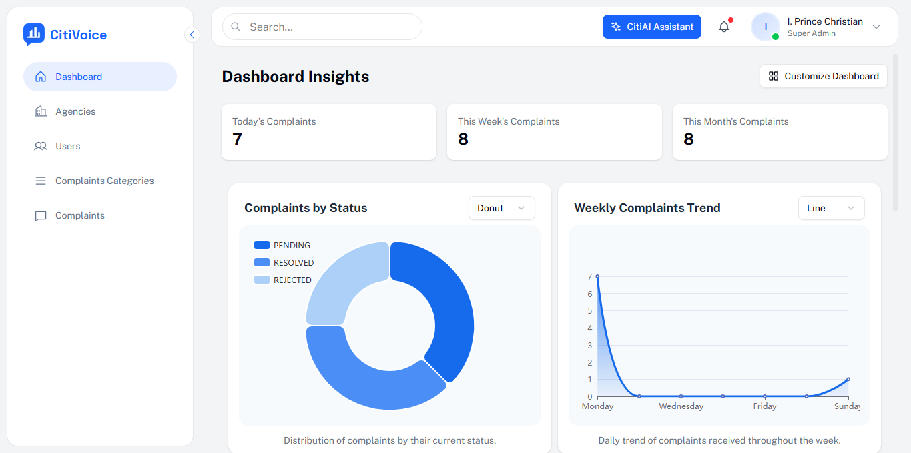

# 🧠 CitiVoice System (Frontend)  | Link -  [CitiVoice](https://citi-voice-frontend-nu.vercel.app/)

## Credentials (SUPER ADMIN)
Email : superadmin.citivoice@yopmail.com
Password : 12345678

# Demo [click here to watch](https://drive.google.com/file/d/1H7H0iYLDOSprt9k-5JvjMp2AD74pTLta/view?usp=drive_link)


In many regions, complaints and feedback regarding public services are handled through fragmented, informal, or outdated channels, often resulting in delayed responses, lack of accountability, and low citizen satisfaction.

The **CitizVoice System** aims to address this gap by providing a centralized, digital platform where citizens can easily submit complaints or feedback and track their resolution. Government institutions can efficiently receive, categorize, and respond to submissions via a simple, streamlined interface.



## Tech Stack Used

| Frontend      | Backend     | Database            | Authentication | Other Tools                          |
|---------------|-------------|---------------------|----------------|--------------------------------------|
| **Next.js**   | **NestJS**  | PostgreSQL + Prisma | JWT            | Tailwind CSS, TanStack Query, shadcn | 

## Getting Started

### 1. Clone the Repository

```bash
git clone https://github.com/princechrix/citi-voice-frontend.git
cd citi-voice-frontend
```

### 2. Set Up Environment Variables

```bash
NEXT_PUBLIC_API_URL=
NEXT_PUBLIC_CREATE_USER_SECRET_KEY=
OPENAI_API_KEY=
GOOGLE_AI_API_KEY=
```


### 3. Install the dependencies & run the project

```bash
pnpm install
pnpm run dev
```


### 4. Deployment
It is deployed on vercel, here is the link to it : [CitiVoice](https://citi-voice-frontend-nu.vercel.app/)
